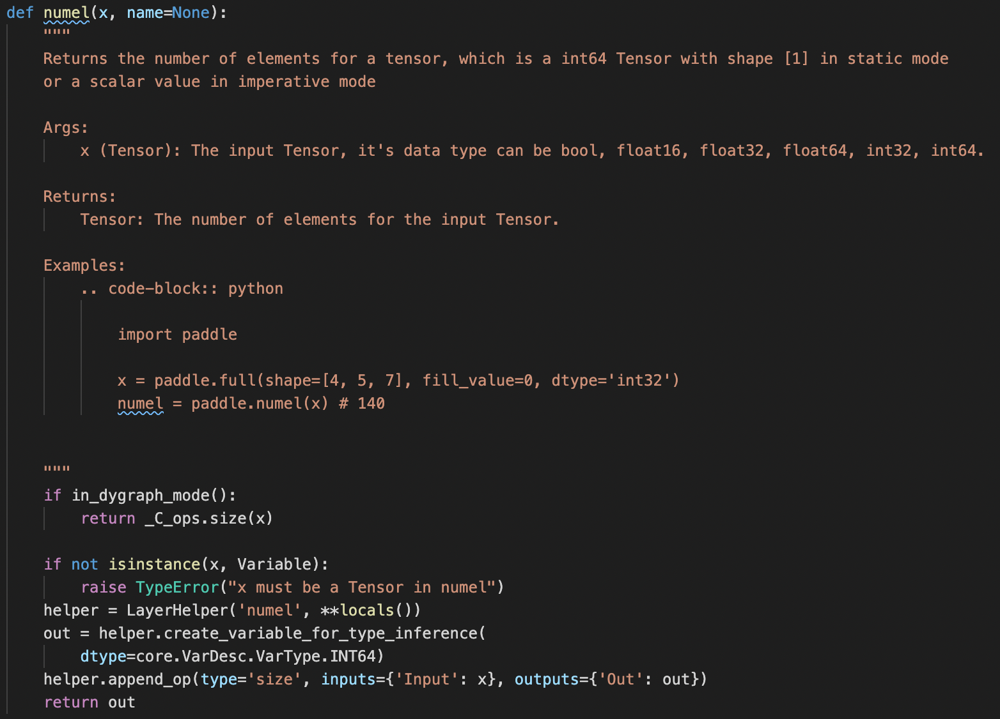
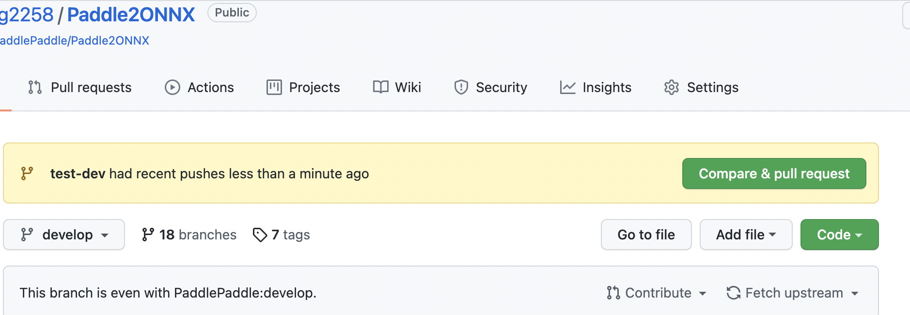
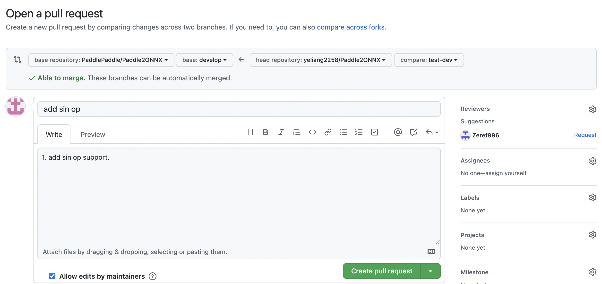
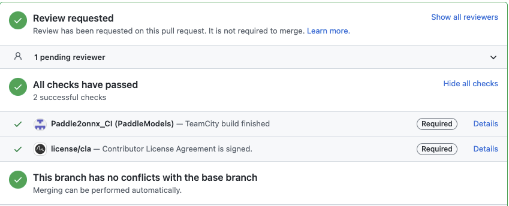

# Paddle2ONNX开发指南
本文档为Paddle2ONNX的新OP开发指南，旨在帮助开发者快速掌握Paddle2ONNX的新OP开发方式，在遇到模型转换失败时能有应对方法，快速解决自己遇到的问题。
## Paddle2ONNX简介 ##
ONNX (Open Neural Network Exchange) 是针对机器学习所设计的开源文件格式，用于存储训练好的模型。它使得不同的人工智能框架可以采用相同格式存储模型并交互。通过ONNX格式，Paddle模型可以使用OpenVINO、ONNX Runtime和TensorRT等推理框架进行推理。
Paddle2ONNX是PaddlePaddle的工具套件，负责将Paddle的inference模型转换为ONNX格式，便于开发者将Paddle模型扩展到支持ONNX部署的框架上进行推理。
## Paddle2ONNX新OP开发步骤 ##
Paddle2ONNX开发的主要步骤为：  
1.根据Paddle OP查阅对应的Paddle API并掌握其使用方法；  
2.根据Paddle OP的原理通过ONNX OP直接或者组合实现相同功能；  
3.为Paddle OP的转换添加单测；  
4.为Paddle2ONNX提PR；  
### 查找Paddle API和paddle OP对应关系 ###
Paddle OP的转换需要掌握Paddle OP的原理和使用方式，因此需要查阅Paddle OP对应的Paddle API。  
当遇到某个模型转换失败，提示某个Paddle OP不支持时，可以通过以下方式查找对应的Paddle API：  
1.通常情况下Paddle的OP和API名字接近，我们可以通过[Paddle文档](https://www.paddlepaddle.org.cn/documentation/docs/zh/guides/index_cn.html)直接查询Paddle OP对应的Paddle API。  
2.如果通过Paddle OP名无法搜到或者不确定时需要到[Paddle源码](https://github.com/PaddlePaddle/Paddle)中去搜索。  
- 首先下载Paddle源码，然后到Paddle/python/paddle文件夹下全局搜索OP名，如果搜索到某个OP的python接口使用到了该OP，则表示该API为对应结果。
- 由于paddle.fluid中的API不推荐使用，所以避免找其中的API。  
- 比如需要查找size这个Paddle OP对应的API，在Paddle文档中并不能找到结果，在Paddle/python/paddle文件夹下全局搜索到Paddle/python/paddle/tensor/stat.py脚本中paddle.numel API接口使用到了size op，因此可确认paddle.numel为size op的对应API。

3.找到对应API后需要到Paddle文档中掌握其使用方法，尤其是其输入和属性，在ONNX OP实现Paddle OP时需要尽可能将所有功能都实现。
### ONNX OP实现Paddle OP
掌握Paddle OP的原理和使用方式后，查阅[ONNX OP列表](https://github.com/onnx/onnx/blob/master/docs/Operators.md)找到对应的实现，若ONNX OP和Paddle OP没有一对一的实现，则需要根据Paddle OP的原理使用多个ONNX OP组合实现。  
下面以Paddle的gelu OP为例，新增一个Gelu类，新的OP转换请在Paddle2ONNX/paddle2onnx/op_mapper文件夹中实现，并根据API的类别实现于相应的文件中：

    @op_mapper('gelu')
    class Gelu():
        support_opset_version_range = (9, 12)
        @classmethod
        def opset_9(cls, graph, node, **kw):
            if node.attr('approximate'):
                raise Exception("Not support approximate is True.")
            input = node.input('X', 0)
            sqrt2 = graph.make_node(
                'Constant', dtype=dtypes.ONNX.FLOAT, value=[1.4142135623730951])
            zero_point_five = graph.make_node(
                'Constant', dtype=dtypes.ONNX.FLOAT, value=[0.5])
            one = graph.make_node('Constant', dtype=dtypes.ONNX.FLOAT, value=[1])
            x = graph.make_node('Div', inputs=[input, sqrt2])
            x = graph.make_node('Erf', inputs=x)
            x = graph.make_node('Add', inputs=[x, one])
            x = graph.make_node('Mul', inputs=[input, x])
            graph.make_node(
                'Mul', inputs=[x, zero_point_five], outputs=node.output('Out'))

 - 注册多版本的算子转换：使用OpMapper装饰，并传入参数gelu为paddle kernel的名称，为Gelu类新增名为opset_7的classmethod，OpMapper注册的机制约束了该方法名：前缀必须为opset_，后面跟一个数字由于表明支持转换到ONNX opset的下限，意味着用户指定转出opset>=7的情况下，都会选择opset_7这个方法来实现具体的转换逻辑，但如果同时为Gelu类实现了opset_9的方法，用户指定转出opset>=9时，会优先选择opset_9的方法来转换。
 - opset_[number]方法的参数：ONNXGraph graph，PaddleNode node，以及kw，其中graph用于组网，node是要转换的Paddle算子。kw的使用方法，请参照下面代码示例，ActivationOps类在使用OpMapper装饰时候，传入了一个list，表示这个类支持了多个Paddle激活算子的转换逻辑，同时传入了mapper_dict参数，这个参数绑定了Paddle OP到ONNX OP的关系，通过在opset_[number]方法调用kw['mapper_dict'][node.type] 可获取要转换的ONNX OP名称。

        @op_mapper(
            ['relu', 'tanh', 'log', 'sigmoid', 'sqrt'],
            mapper_dict={
            'relu': 'Relu',
            'tanh': 'Tanh',
            'log': 'Log',
            'sigmoid': 'Sigmoid',
            'sqrt': 'Sqrt',
            })
        class ActivationOps():
            support_opset_version_range = (1, 12)

            @classmethod
            def opset_1(cls, graph, node, **kw):
                onnx_type = kw['mapper_dict'][node.type]
                onnx_node = graph.make_node(
                    onnx_type, inputs=node.input('X'), outputs=node.output('Out'))

 - ONNX组网：通过调用graph.make_node方法对onnx_graph进行组网，graph.make_node的接口定义如下:

        ONNXGraph.make_node接口
        参数：
          op_type, # onnx算子的type
          inputs=[], # 该算子的输入，支持输入为ONNXNode|str，list[ONNXNode|str]
          outputs=[], # 该算子输出，支持输入为str|int|[], 为[]时自动生成一个output，为int时自动输入指定int大小的outputs。
          attrs=None, # 该算子属性
          layer_name=None, # 该算子的名称
          **kw，
        return
        node.outputs # 算子的输出
 - 输出绑定：请根据Paddle node的输出名称，为组网结束时的OP指定outputs。
 - 实现OP转换时请将不同opset version版本的OP都实现。

### 实现Paddle OP转换的单测
为了确保转换的正确性，请在OP实现完成之后为该转换写单测。
一个简单的例子如下：

    import paddle
    from onnxbase import APIOnnx
    from onnxbase import randtool

    class Net(paddle.nn.Layer):
    """
    simplr Net
    """

        def __init__(self):
            super(Net, self).__init__()

        def forward(self, inputs):
            """
            forward
            """
            x = paddle.abs(inputs)
            return x

    def test_abs_9():
        """
        api: paddle.abs
        op version: 9
        """
        op = Net()
        op.eval()
        # net, name, ver_list, delta=1e-6, rtol=1e-5
        obj = APIOnnx(op, 'abs', [9])
        obj.set_input_data(
            "input_data",
            paddle.to_tensor(
                randtool("float", -1, 1, [3, 3, 3]).astype('float32')))
        obj.run()

 - 单测都写到Paddle2ONNX/tests文件夹下，创建和OP名相同的单测文件，使用待测试的Paddle API搭建简单的网络，然后构建单测用例。
 - 单测文件名以test_ 开头，测试用例以def test_开头，名称要简单明了，从命名就知道测试的内容是什么。
 - 单测需要全面测试到所有情况。
 - 单测中网络定义可以有多个输入，APIOnnx接口的ver_list可以为一个列表，多个opset version放到一起进行测试，此外diff对比时的delta和rtol精度可以设置，默认为1e-6和1e-5，具体可以参考[floor_divide测试用例](https://github.com/PaddlePaddle/Paddle2ONNX/blob/develop/tests/test_floor_divide.py)。

## 为Paddle2ONNX提PR ##
繁荣的生态需要大家的携手共建，期待和感谢大家为PaddlePaddle贡献自己的力量。
为Paddle2ONNX提PR需要的步骤有：
 1. 进入[Paddle2ONNX官方Repo](https://github.com/PaddlePaddle/Paddle2ONNX)，点击右上角的Star关注Repo的最新动向，然后点击Fork将代码克隆到自己的代码库中。
 2. 返回自己的主页，使用git clone将Fork的代码克隆到本地，然后在克隆代码的根目录下运行pre-commit install安装pre-commit钩子，以在提交代码时完成代码风格的检查。
 3. 按照要求进行开发，开发中请依次完成OP转换和单测，并多写英文注释，便于代码更容易让人理解。
 4. 开发完成后将本地修改git commit到本地仓库，然后git push origin XXX到远端仓库，此时回到github中Fork的Repo可以看到为如下提示：
 
 点击 compare&pull request 按钮，然后出现如下界面，这里需要写言简意赅的标题和详细的修改内容。认真填写完成之后点击creat pull request完成PR。
 
 5. 进入到Paddle2ONNX的官方Repo可以在[Pull Request](https://github.com/PaddlePaddle/Paddle2ONNX/pulls)中可以看到提交的PR，PR中有CI测试，如果CI测试没有通过，请点击没有通过CI后的Details查看详情并修改，通过CI之后会有专人进行code review和merge。

 6. 更详细的资料请参考[Paddle的PR指南](https://www.paddlepaddle.org.cn/documentation/docs/zh/guides/10_contribution/submit_pr_guide_cn.html)
