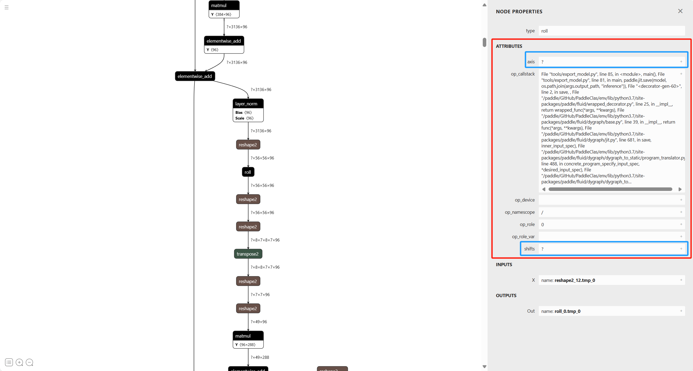

# Paddle2ONNX 开发指南

本文档为 Paddle2ONNX 的新 OP 开发指南，旨在帮助开发者快速掌握 Paddle2ONNX 的新 OP 开发方式，在遇到模型转换失败时能有应对方法，快速解决自己遇到的问题。

## 1 Paddle2ONNX 简介

### 1.1 什么是 ONNX

ONNX（Open Neural Network Exchange）是一个开放的深度学习模型交换格式，旨在使不同深度学习框架之间的模型转换和互操作变得更加容易。它由微软和Facebook联合开发，于2017年宣布发布。ONNX的主要目标是使深度学习模型在不同框架之间更容易地移植和部署。通过 ONNX 格式，Paddle 模型可以使用 ONNXRuntime、RKNNRuntime 和 TensorRT 等推理框架进行推理。

### 1.2 什么是 Paddle2ONNX

Paddle2ONNX 是 PaddlePaddle 的工具套件之一，负责将 Paddle 的 Inference 模型转换为 ONNX 格式，便于开发者将 Paddle 模型扩展到支持 ONNX 部署的框架上进行推理。

## 2 如何为 Paddle2ONNX 添加一个新算子

Paddle2ONNX 开发的主要步骤为：

1. 根据 Paddle OP 查阅对应的 Paddle API 并掌握其使用方法，您可以通过 [Paddle Operators Docs](https://www.paddlepaddle.org.cn/documentation/docs/zh/api/paddle/Overview_cn.html) 来快速查询 Paddle Operators 的使用方法。
2. 根据 Paddle OP 的原理通过 ONNX OP 直接或者组合实现相同功能，您可以通过 [ONNX Operators Docs](https://onnx.ai/onnx/operators/index.html) 来快速查询 ONNX Operators 的使用方法。
3. 在 Paddle2ONNX 中添加转换
4. 为 Paddle2ONNX 的转换添加单测
5. 为 Paddle2ONNX 提 PR

## 3 为 Paddle2ONNX 添加 roll 算子（举例）

### 3.1 可视化模型并找到需要添加支持的算子

一般来说，为 Paddle2ONNX 添加/修复新算子的原因是导出模型时碰到问题，此时开发者的手头上应该已经准备了一个含有该算子的 Paddle Inference 模型（我这里是 Swin 模型），使用 [Netron](https://netron.app/) 打开这个模型，并找到不支持的算子（我这里是 roll 算子），如下图：



### 3.2 查阅 Paddle API 文档

一般来说， Paddle 的 OP 和 API 名字接近。我们可以通过 [Paddle Operators Docs](https://www.paddlepaddle.org.cn/documentation/docs/zh/api/paddle/Overview_cn.html) 直接查询 Paddle OP 对应的 Paddle API。
通过 Netron 的可视化，我们已经知道该算子名字为 **roll** ，我们可以继续通过 [Paddle roll Docs](https://www.paddlepaddle.org.cn/documentation/docs/zh/api/paddle/roll_cn.html#roll) 直接查询 Paddle OP 对应的 Paddle API，该算子核心文档如下：

> paddle.roll(x, shifts, axis=None, name=None)
>
> 函数用途：
>
> 沿着指定维度 axis 对输入 x 进行循环滚动，当元素移动到最后位置时，会从第一个位置重新插入。如果 axis 为 None，则输入在被循环滚动之前，会先展平成 1-D Tensor，滚动操作完成后恢复成原来的形状。
>
> 参数：
>
> * x （Tensor）– 输入的 Tensor。
>
> * shifts (int|list|tuple) - 滚动位移。如果 shifts 是一个元组或者列表，则 axis 必须是相同大小的元组或者列表，输入 Tensor 将依次沿着每个维度滚动相应的数值。
>
> * axis (int|list|tuple，可选) – 滚动轴。默认值为 None。
>
> * name (str，可选) - 具体用法请参见 Name，一般无需设置，默认值为 None。

通过 Netron 的可视化，可以看到， **ATTRIBUTES** 中的参数 **axis** 和 **shifts** 与核心文档中的输入参数一一对应。

> [!NOTE]
> 获取当前所有支持的 OP 列表的方法：
>
> ```python
> import paddle2onnx
> paddle2onnx.get_all_supported_operators()
> ```

### 3.3 查阅 ONNX API 文档

掌握 Paddle OP 的原理和使用方式后，查阅 [ONNX Operators Docs](https://onnx.ai/onnx/operators/index.html) 找到对应的实现，若 ONNX OP 和 Paddle OP 没有一对一的实现，则需要根据 Paddle OP 的原理使用多个 ONNX OP 组合实现。
当我们在 [ONNX Operators Docs](https://onnx.ai/onnx/operators/index.html) 中查找 roll 算子时，我们会发现 ONNX 并没有直接实现这个算子，因此我们需要把这个算子手动拆分为 ONNX 支持的形式。
这里我参考了 [torch 导出 roll 算子](https://github.com/pytorch/pytorch/blob/d39790340db916e128b2b637cd12f4616fddb87d/torch/onnx/symbolic_opset9.py#L3261)，准备将roll算子用 **Slice** 和 **Concat** 来实现。

### 3.4 在 Paddle2ONNX 中新建转换文件

新的 OP 转换实现需要根据算子的类别来新建转换代码，具体规则如下：

1. 如是 conv2d、pool2d 和 pad 等算子，需要将算子转换实现于 Paddle2ONNX/paddle2onnx/mapper/nn 中
2. 如是 rule、relu6 和 sigmod 等激活值类别算子，需要将算子转换实现于 Paddle2ONNX/paddle2onnx/mapper/activation.* 中
3. 如是 eye、cumsum 和 index_sample 等 tensor 处理类算子，需要将算子转换实现于 Paddle2ONNX/paddle2onnx/mapper/tensor 中

根据以上规则，我们可以在 **Paddle2ONNX/paddle2onnx/mapper/tensor** 下分别新建 **roll.cc** 和 **roll.h**。

### 3.5 在转换文件中添加转换代码

在头文件中我们需要实现 OPNameMapper 类，该类需要继承 Mapper 基类。以 roll 算子为例，我们需要在 roll.h 中新建 **RollMapper** 类，代码如下：

```c++
#pragma once
#include <string>
#include <vector>

#include "paddle2onnx/mapper/mapper.h"

namespace paddle2onnx {

class RollMapper : public Mapper {
 public:
  RollMapper(const PaddleParser& p, OnnxHelper* helper, int64_t block_id,
             int64_t op_id)
      : Mapper(p, helper, block_id, op_id) {}
  void Opset7() override;
};

}  // namespace paddle2onnx
```

> 注：
> * Paddle2ONNX 需要实现 Opset version 7～16，如果实现的 OP 不是从 Opset version 7 开始，或者由于 Paddle OP 中的某些属性导致无法导出为ONNX，则需要重写基类中的 GetMinOpsetVersion 函数，该函数返回 -1 表示该 OP 无法导出为 ONNX，否则表示导出该 OP 所需的最小 Opset version
> * OpsetX 函数表示 opset version 为 x 时的转换实现函数，如果定义了 Opset7 和 Opset10 两个转换方法，意味着用户指定转出 opset version 7～9 时，使用 Opset7 中的转换逻辑实现转换，用户指定 opset version 10～16 时，使用 Opset10 中的转换逻辑实现转换


然后我们在 roll.cc 中添加实现。首先我们需要使用 **REGISTER_MAPPER** 宏来注册算子，第一个参数填写我们获取到的算子名称（这里是 roll ），第二个参数填写转换类的名称（这里是 RollMapper ）

```c++
#include <limits>
#include "paddle2onnx/mapper/tensor/roll.h"

namespace paddle2onnx {
REGISTER_MAPPER(roll, RollMapper)
}
```

接着，添加核心转换代码。与 torch 的转换代码不同的是，Paddle 的 roll 算子在 axis 为 None 时，该算子会在输入被循环滚动之前，将输入先展平成 1-D Tensor，滚动操作完成后恢复成原来的形状，我们先对这种特殊情况添加实现：

```c++
#include <limits>
#include "paddle2onnx/mapper/tensor/roll.h"

namespace paddle2onnx {
void RollMapper::Opset7() {
  auto input_info = GetInput("X");
  auto output_info = GetOutput("Out");

  std::vector<int64_t> shifts;
  GetAttr("shifts", &shifts);
  std::vector<int64_t> axis;
  GetAttr("axis", &axis);

  std::shared_ptr<ONNX_NAMESPACE::NodeProto> temp_node= nullptr;
  auto result_name = input_info[0].name;
  if (axis.empty())
  {
    int64_t axes = 0;
    result_name = helper_->Flatten(result_name);
    for(int i = 0;i < shifts.size();i++) {
      auto shift = shifts[i];
      auto result_0 = helper_->Slice(result_name, {axes}, {-shift}, {(std::numeric_limits<int64_t>::max)()});
      auto result_1 = helper_->Slice(result_name, {axes}, {0}, {-shift});
      temp_node = helper_->MakeNode("Concat", {result_0, result_1});
      AddAttribute(temp_node, "axis", axes);
      result_name = temp_node->output(0);
    }
    helper_->Reshape(result_name, output_info[0].name, input_info[0].shape);
    // helper_->MakeNode("Reshape", {result_name, input_info[0].shape}, {output_info[0].name});
  }
}
}
```

> 注：
> * Paddle2ONNX 使用 **helper_->MakeNode** 来实现组网，函数的具体定义可参考：[Paddle2ONNX/paddle2onnx/mapper/onnx_helper.cc](../../paddle2onnx/mapper/onnx_helper.cc)
> * AddAttribute 可为 Node 新增属性信息，具体的函数定义可参考：[Paddle2ONNX/paddle2onnx/mapper/onnx_helper.cc](../../paddle2onnx/mapper/onnx_helper.cc)
> * [Paddle2ONNX/paddle2onnx/mapper/onnx_helper.h](../../paddle2onnx/mapper/onnx_helper.cc) 中提供了大量的辅助组网信息，比如 Split, Transpose, Slice, Reshape 等等，可以有效的简化转换逻辑，推荐优先使用 Paddle2ONNX 提供的函数
> * ONNX 的 OP 定义以及 opset version 等信息可以查阅：[ONNX Operators Docs](https://onnx.ai/onnx/operators/index.html)

然后我们使用 torch 转换代码相同的逻辑来添加非默认情况下的实现

```c++
#include <limits>
#include "paddle2onnx/mapper/tensor/roll.h"

namespace paddle2onnx {
void RollMapper::Opset7() {
  auto input_info = GetInput("X");
  auto output_info = GetOutput("Out");

  std::vector<int64_t> shifts;
  GetAttr("shifts", &shifts);
  std::vector<int64_t> axis;
  GetAttr("axis", &axis);

  std::shared_ptr<ONNX_NAMESPACE::NodeProto> temp_node= nullptr;
  auto result_name = input_info[0].name;
  if (axis.empty())
  {
  } else {
    for(int i = 0;i < shifts.size();i++) {
      auto shift = shifts[i];
      int64_t axes = axis[i];
      auto result_0 = helper_->Slice(result_name, {axes}, {-shift}, {(std::numeric_limits<int64_t>::max)()});
      auto result_1 = helper_->Slice(result_name, {axes}, {0}, {-shift});
      if(i+1 == shifts.size()) {
        temp_node = helper_->MakeNode("Concat", {result_0, result_1}, {output_info[0].name});
      } else {
        temp_node = helper_->MakeNode("Concat", {result_0, result_1});
      }
      AddAttribute(temp_node, "axis", axes);
      result_name = temp_node->output(0);
    }
  }
}
}
```

### 3.6 实现 Paddle OP 转换的简单单测

为了确保转换的正确性，请在 OP 实现完成之后为该转换写单测，单测实现的位置在 [Paddle2ONNX/tests](../../tests) 目录下，一般命名为 **test_op_name.py**。

单测分为简单单测和扫描单测两种，一般情况下，对于简单的不容易出错的算子只需要添加简单单测，复杂的算子添加扫描单测。

对于 roll 算子，我们可以新建 **test_roll.py** 并添加如下的简单单测：

```python
import paddle
from onnxbase import APIOnnx
from onnxbase import randtool


class Net(paddle.nn.Layer):
    """
    simple Net
    """

    def __init__(self):
        super(Net, self).__init__()

    def forward(self, inputs):
        """
        forward
        """
        x = paddle.roll(inputs, 1)
        return x


def test_roll():
    """
    api: paddle.roll
    op version: 9
    """
    op = Net()
    op.eval()
    # net, name, ver_list, delta=1e-6, rtol=1e-5
    obj = APIOnnx(op, 'roll', [9])
    input_data = paddle.to_tensor(randtool("float", -1, 1, [2,2]).astype('float32'))
    print(input_data)
    obj.set_input_data(
        "input_data",
        input_data
        )
    obj.run()

if __name__ == "__main__":
    test_roll()
```

### 3.7 实现 Paddle OP 转换的扫描单测

简单单测对于简单算子就够用了，但是对于 argsort 这样的复杂算子，我们可以新建 **test_auto_scan_argsort.py** 并添加扫描单测：

首先实现一个组网类，需要满足以下要求：

1. 继承自 BaseNet，不需写 __init__，只需实现 forward 便可
2. 将 config 传入到 Net 中，然后在 self.config 中取出你所有想要的数据

```python
class Net(BaseNet):
    """
    simple Net
    """

    def forward(self, input):
        """
        forward
        """

        x = paddle.argsort(
            input,
            axis=self.config['axis'],
            descending=self.config['descending'])
        return x
```

接着实现单测类，继承自 OPConvertAutoScanTest，需要写 sample_convert_config 和 test 两个函数，需要满足以下要求：

1. 单测类继承自 OPConvertAutoScanTest。
2. sample_convert_config 函数首先根据测试 API 的文档随机生成所有可测的数值，然后将所有需要用到的数据放到 config 中，config 是一个 dict，需传入到组网类中，sample_convert_config 函数的返回值为 (config, model)
3. sample_convert_config 函数中的 config 注意必须包括以下 key：
> **op_names**：`list of str`，需要检查的 OP 名，如：["conv2d"]表示要测试的 OP 为 conv2d。
> **test_data_shapes**：`list of list`，测试数据的 shape，如：[[10, 32, 10, 10], [64, 32, 3, 3]]表示第一个输入的 shape 为 [10, 32, 10, 10]，第二个输入的 shape 为 [64, 32, 3, 3]。
> **test_data_types**：`list of list`，测试数据的数据类型，长度必须和 `test_data_shapes` 一致，如：[[“float32“, "float64"], ["int32",  "int64"]]表示第一个输入支持的数据类型为 “float32“ 和 "float64"，第二个输入支持的数据类型为 "int32" 和 "int64"。
> **opset_version**：`list`，表示需要测试的 opset version，只需要设置支持的最小 opset version 便可，如 [9] 表示测试opset version为 9～16 的转换。
> **input_spec_shape**：`list of list`，为了支持动态shape而设置，如 [[-1, 3, -1, -1],[-1, 3, -1, -1]] 表示两个输入都为动态 shape，如果不需要测试动态 shape 的转换，请直接设置为 []。
4. 其他所有的参数都可以放到 config 中，然后在 Net 中取出需要的数据，同时 config 中的数据在运行单测时也会实时打印出来便于调试。
5. 返回参数 `model` 是一个 Net() 对象或者 list of Net()，list of Net() 可以实现一个单测测试多个 OP 转换，具体可参考[`test_auto_scan_unary_ops.py`](https://github.com/PaddlePaddle/Paddle2ONNX/blob/develop/tests/test_auto_scan_unary_ops.py)

```python
class TestArgsortConvert(OPConvertAutoScanTest):
    """
    api: paddle.argsort
    OPset version: 11, 15
    """

    def sample_convert_config(self, draw):
        input_shape = draw(
            st.lists(
                st.integers(
                    min_value=2, max_value=5), min_size=2, max_size=5))

        axis = draw(
            st.integers(
                min_value=-len(input_shape), max_value=len(input_shape) - 1))

        dtype = draw(st.sampled_from(["float32", "float64"]))
        descending = draw(st.booleans())

        def generator_data():
            import random
            import numpy as np
            t = 1
            for i in range(len(input_shape)):
                t = t * input_shape[i]
            input_data = np.array(random.sample(range(-5000, 5000), t))
            input_data = input_data.reshape(input_shape)
            return input_data

        if descending:
            opset_version = [7, 10, 11, 15]
        else:
            opset_version = [11, 15]
        config = {
            "op_names": ["argsort"],
            "test_data_shapes": [generator_data],
            "test_data_types": [[dtype]],
            "opset_version": opset_version,
            "input_spec_shape": [],
            "axis": axis,
            "descending": descending,
        }

        models = Net(config)

        return (config, models)

    def test(self):
        self.run_and_statis(max_examples=30)
```

Paddle2ONNX 已经实现了大量 OP 的单测，可以参考 Paddle2ONNX/test/* 中已经实现的单测：
* 单个单测测试单个 API 示例：[`test_auto_scan_conv2d.py`](https://github.com/PaddlePaddle/Paddle2ONNX/blob/develop/tests/test_auto_scan_conv2d.py)
* 单个单测测试多个 API 示例：[`test_auto_scan_unary_ops.py`](https://github.com/PaddlePaddle/Paddle2ONNX/blob/develop/tests/test_auto_scan_unary_ops.py)
* 支持生成自定义数据，请参考：[`test_auto_scan_lookup_table_v2.py`](https://github.com/PaddlePaddle/Paddle2ONNX/blob/develop/tests/test_auto_scan_lookup_table_v2.py)

## 4 为 Paddle2ONNX 提 PR
繁荣的生态需要大家的携手共建，期待和感谢大家为 PaddlePaddle 贡献自己的力量

为 Paddle2ONNX 提 PR 需要的步骤有：
 1. 进入[Paddle2ONNX 官方 Repo](https://github.com/PaddlePaddle/Paddle2ONNX)，点击右上角的 Star 关注 Repo 的最新动向，然后点击 Fork 将代码克隆到自己的代码库中。
 2. 返回自己的主页，使用 git clone 将 Fork 的代码克隆到本地，然后在克隆代码的根目录下运行 pre-commit install 安装 pre-commit 钩子，以在提交代码时完成代码风格的检查。
 3. 按照要求进行开发，开发中请依次完成 OP 转换和单测，并多写英文注释，便于代码更容易让人理解。
 4. 开发完成后将本地修改 git commit 到本地仓库，然后 git push origin XXX 到远端仓库，此时回到 github 中 Fork 的 Repo 可以看到为如下提示：
 
 点击 compare&pull request 按钮，然后出现如下界面，这里需要写言简意赅的标题和详细的修改内容。认真填写完成之后点击 creat pull request 完成 PR。
 
 5. 进入到 Paddle2ONNX 的官方 Repo 可以在[Pull Request](https://github.com/PaddlePaddle/Paddle2ONNX/pulls) 中可以看到提交的 PR，PR 中有 CI 测试，如果 CI 测试没有通过，请点击没有通过 CI 后的 Details 查看详情并修改，通过 CI 之后会有专人进行 code review 和 merge。

 6. 更详细的资料请参考[Paddle 的 PR 指南](https://www.paddlepaddle.org.cn/documentation/docs/zh/guides/10_contribution/submit_pr_guide_cn.html)
