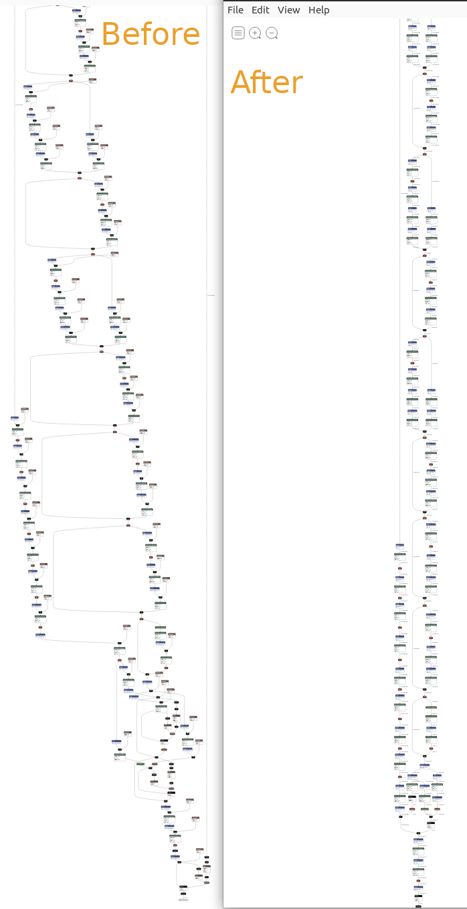
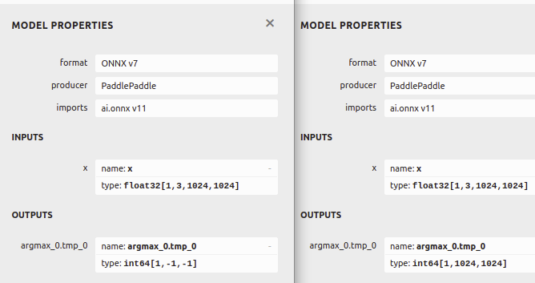
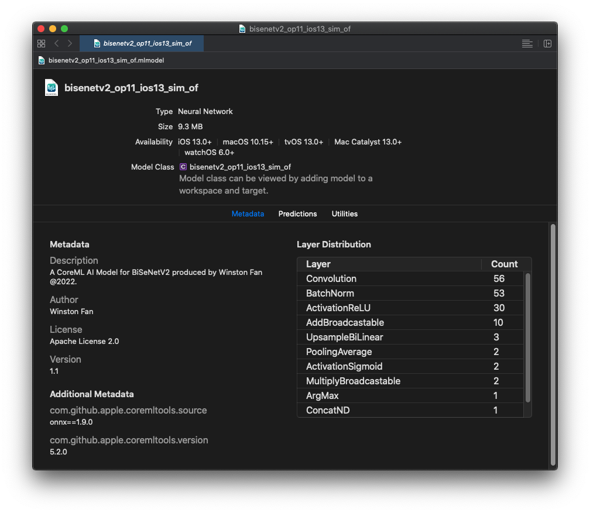

# BiSeNetV2 iOS部署教程

本篇文章将展示如何在Ubuntu 20.04下将PaddleSeg下的分割模型[BiSeNetV2](https://github.com/PaddlePaddle/PaddleSeg/blob/release/2.4/configs/bisenet)一步一步的转换成iOS可识别的mlmodel格式模型.


该过程的步骤为:

0. 将Paddle模型转换成推理模型
1. 将Paddle 推理模型转换成ONNX模型
2. 将ONNX模型转换成 iOS识别的mlmodel格式模型
3. 将转换好的mlmodel模型导入Swift项目
4. 使用XCode自动为mlmodel模型生成的类来进行推理

## 0. 将Paddle动态模型导出为推理模型


首先需要克隆PaddleSeg项目:

`git clone https://github.com/PaddlePaddle/PaddleSeg.git`


然后CD到PaddleSeg的根目录下面, 在terminal下输入如下命令:

```
python export.py --config configs/bisenet/bisenet_cityscapes_1024x1024_160k.yml --model_path BiSeNetV2/model.pdparams --save_dir output/infer --input_shape 1 3 1024 1024
```

来解释一下这个命令:

`--config`来指定这个模型导出时候需要用到的配置文件;

`--model_path`来指定模型的参数文件;

`--input_shape 1 3 1024 1024`: 指定了模型需要的图形尺寸.


成功之后, 将会产生4个文件 
`deploy.yaml`, `model.pdiparams`, `model.pdiparams.info`,`model.pdmodel`

Step 0完成.


## 1. 转换Paddle --> ONNX 模型

本教程将使用Anaconda来创建虚拟环境, 所以在开始转换之前,请确保您已经[安装好Anaconda](https://docs.anaconda.com/anaconda/install/index.html).

### 1. 创建一个新的conda环境

`conda create --name ios python=3.7`

激活新创建的环境

`conda activate ios`

### 2. 安装依赖项

`conda install onnx coremltools paddle2onnx onnx-simplifier`

如果上述某个依赖项找不到, 那么请用`pip`来安装, 例如:
`pip install paddle2onnx`

### 3. 转Paddle --> ONNX

#### 1. 转Paddle为ONNX
打开terminal, cd到刚才导出的infernece模型的文件夹下， 输入如下指令 即可将Paddle模型转换成ONNX模型

```
paddle2onnx --model_dir . --model_filename model.pdmodel \
--params_filename model.pdiparams --opset_version 11 \
--enable_onnx_checker True --save_file BiSeNetV2.onnx
```

这里注意把 里面模型的目录指向正确的文件夹。 大部分参数都是不喻自明的, 只解释如下两个参数:

`--opset_version` 指定了使用算子的版本为11， 目前可以有 9 - 12.

`--enable_onnx_checker` 用来开启ONNX模型校验。


转换成功后您将会看到一个新生成的ONNX模型： `BiSeNetV2.onnx`. 

#### 2. 模型简化

通过`onnx-simplifier` 模型可以被进一步简化:

首先请安装:

```
pip install onnx-simplifier
```

运行:
```
onnxsim BiSeNetV2.onnx BiSeNetV2_sim.onnx
```

至于为什么要简化, 我们可以用一张经典的Before v.s. After对照图来一目了然:

<div style="width:100%; display:flex;">
    
</div>

> ***Note:具体节点看不清楚不要紧, 这个主要是看整体结构的对比.***

可以看出, 简化后的模型看起来更规整.这也有利于之后的处理.


#### 3. 固定下模型每个节点的Shape

运行[shape_infer.py](../shape_infer.py)来固定每个节点的shapes.

```
python shape_infer.py --input /BiSeNetV2_sim.onnx --output /BiSeNetV2_sim_of.onnx 
```

<div style="width:100%; display:flex;">
    
</div>


可以清楚的看到在固定下Shape之后 输出节点的Shape便被固定了下来, 方便后期差错处理.


ONNX阶段转化完毕.

> ***[NOTE] 如果您想直接使用已经转换好的ONNX模型,可以在这里下载: [BiSeNetV2_sim_of.onnx](https://1drv.ms/u/s!Asflam6BEzhjgbM9dWj1ZiGH0_KOqw?e=FOFeSJ).***

## 2. ONNX --> Coreml模型

[CoreML](https://developer.apple.com/documentation/coreml)是苹果在iOS平台上的AI框架。 我们需要通过[Coremltools](https://coremltools.readme.io/docs)工具来把ONNX模型转换成为 `.mlmodel`格式的CoreML模型。

### 1. 配置好转换时候的参数

首先我们要知道BiSeNetV2的配置是什么, [bisenet_cityscapes_1024x1024_160k.yml](https://github.com/PaddlePaddle/PaddleSeg/blob/release/2.4/configs/bisenet/bisenet_cityscapes_1024x1024_160k.yml), 用的是PaddleSeg默认的Normalize, 所以Mean和Std分别是:

`mean: [0.5,0.5,0.5], std: [0.5, 0.5,0.5]`


```
model = ct.converters.onnx.convert(
    model = "BiSeNetV2_sim_of.onnx",    
    minimum_ios_deployment_target = '13',
    preprocessing_args={
        "image_scale": 1./(0.5*255.0),
        "red_bias": - 0.5/(0.5),
        "green_bias":- 0.5/(0.5),
        "blue_bias": - 0.5/(0.5)
    },
    image_input_names= ["x"]
)

saved_model_path = root / "bisenetv2"
model.save(saved_model_path)
```

由于苹果并没有直接使用这些Mean和Std这些参数， 而是使用了自己定义的 `image_scale`和各个颜色通道的`bias`来表达`means`以及`std`. 所以我们需要自己计算 `image_scale`以及各个通道的 `bias`. 
这里要划重点，下面的转换公式需要记住：

`output[channel] = (input[channel] - mean [channel]) / std [channel]`

并且我们又知道ImageNet的 `mean`和`std`分别是：

* `mean  [0.5, 0.5, 0.5]`
* `std (standard deviation)  [0.5, 0.5, 0.5]`

`mean`和`std`中的三个值分别对应`red`, `green` and `blue`。 

所以转换下来后的 `bias`分别是：

```
y_red_channel = (x_red_channel/255.0 - 0.5) / 0.5
y_green_channel = (x_green_channel/255.0 - 0.5) / 0.5
y_blue_channel = (x_blue_channel/255.0 - 0.5) / 0.5
```
所以 `bias`计算下来之后是：
```
bias = [- 0.5/(0.5) , - 0.5/(0.5), - 0.5/(0.5)]
```

`image_scale`的计算则是由3个`std`的平均值来表达：

```
0.5 = (0.5 + 0.5 + 0.5)/3)
```

以上就是在转换到CoreML模型的时候 最重要的概念。

之后，我们只需要调用`coremltools`的工具来存储转换好后的模型。

```
model.save(saved_model_path)
```

查看[完整代码](./bisenetv2_convert.py)来了解更多详细信息。

>***[Note]: 如果您想直接使用CoreML模型, 请在这里下载: [bisenetv2_op11_ios13_sim_of.mlmodel](https://1drv.ms/u/s!Asflam6BEzhjgbM-BRH2J5u6NHWaZw).***

## 3. 在XCode中打开CoreML模型

在打开CoreML模型之前, 请确保您已经安装了[XCode](https://developer.apple.com/xcode/).

在Mac上, 双击我们转换好的BiSeNetV2模型, 您将会看到:



要导入CoreML模型到您的Swift项目也很简单, 只需要把模型直接拖拽到项目里即可.
XCode会为您的模型自动生成类,来方便使用.