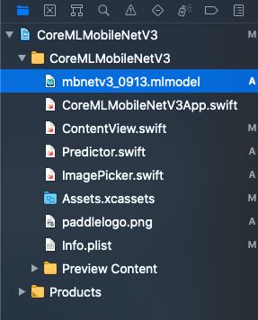
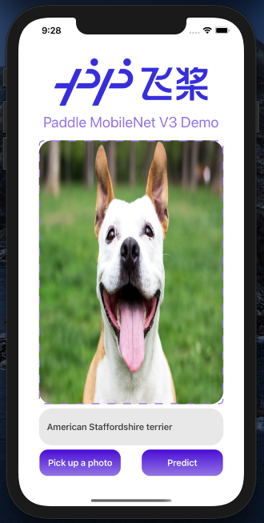

# MobileNetV3 iOS部署教程

本篇文章将展示如何在Ubuntu 20.04下将经典分类模型[MobileNetV3](https://github.com/PaddlePaddle/Paddle2ONNX/tree/model_zoo/model_zoo/classification)一步一步的转换成iOS可识别的mlmodel格式模型. 同时采用苹果最新开发语言Swift以及最新的UI开发框架SwiftUI来做前段实现.


该过程的步骤为:

1. 将Paddle 推理模型转换成ONNX模型
2. 将ONNX模型转换成 iOS识别的mlmodel格式模型
3. 将转换好的mlmodel模型导入Swift项目
4. 使用XCode自动为mlmodel模型生成的类来进行推理


## 1. 转换Paddle --> ONNX 模型

本教程将使用Anaconda来创建虚拟环境, 所以在开始转换之前,请确保您已经[安装好Anaconda](https://docs.anaconda.com/anaconda/install/index.html).

### 1. 创建一个新的conda环境

`conda create --name ios python=3.7`

激活新创建的环境

`conda activate ios`

### 2. 安装依赖项

`conda install onnx coremltools paddle2onnx`

### 3. 转Paddle --> ONNX

首先下载要用到的 [MobileNet V3](https://bj.bcebos.com/paddle2onnx/model_zoo/mobilenetv3.tar.gz)

然后解压模型后得到两个文件推理模型的文件， 分别是： `inference.pdmodel`, `inference.pdiparams` 以及 `inference.pdiparams.info`

然后打开terminal后 cd到模型解压后的文件夹下， 输入如下指令 即可将Paddle模型转换成ONNX模型

```
paddle2onnx --model_dir . \
--model_filename inference.pdmodel \
--params_filename inference.pdiparams \
--input_shape_dict "{'inputs': [1,3,224,224]}" \
--save_file mbnv3s1.onnx --opset_version 9 \
--enable_onnx_checker True
```

这里注意把 里面模型的目录指向正确的文件夹。 

`--input_shape_dict`用来指定了模型输入的shape: `{'inputs': [1,3,224,224]}`.

`--opset_version` 指定了使用算子的版本为9， 目前可以有 9 - 12.

`--enable_onnx_checker` 用来开启ONNX模型校验。


转换成功后您将会看到一个新生成的ONNX模型： `mbnv3s1.onnx`. 

> ***[  NOTE] 如果您想直接使用已经转换好的ONNX模型,可以在这里下载: [mbnv3s1.onnx](https://1drv.ms/u/s!Asflam6BEzhjgbM7SRi4n3QvJiEYvA?e=1wauIp).***


## 2. ONNX --> Coreml模型

CoreML是苹果在iOS平台上模型的格式。 我们需要通过Coremltools工具来把ONNX模型转换成为 `.mlmodel`格式的CoreML模型。

### 1. 配置好转换时候的参数

```
model = ct.converters.onnx.convert(
    mode = 'classifier',
    model = "mbnv3s1.onnx",    
    minimum_ios_deployment_target = '13',
    class_labels = class_labels,
    preprocessing_args={
        "image_scale": 1./(0.226*255.0),
        "red_bias": - 0.485/(0.229),
        "green_bias":- 0.456/(0.224),
        "blue_bias": - 0.406/(0.225)
    },
    image_input_names= ["inputs"]
)

saved_model_path = root / "mbnetv3_0912"
model.save(saved_model_path)
```

在转换MobileNetV3模型时， 由于它是分类模型， 所以我们要指定
`mode='classifier'`

同时最主要的是图像的缩放和 `normalize()`中的means和std. 很可惜的是， 苹果并没有直接使用这些参数， 而是使用了自己定义的 `image_scale`和各个颜色通道的`bias`来表达`means`以及`std`. 所以我们需要自己计算 `image_scale`以及各个通道的 `bias`. 
这里要划重点，下面的转换公式需要记住：

`output[channel] = (input[channel] - mean [channel]) / std [channel]`

并且我们又知道ImageNet的 `mean`和`std`分别是：

* `mean  [0.485, 0.456, 0.406]`
* `std (standard deviation)  [0.229, 0.224, 0.225]`

`mean`和`std`中的三个值分别对应`red`, `green` and `blue`。 

所以转换下来后的 `bias`分别是：

```
y_red_channel = (x_red_channel/255.0 - 0.485) / 0.229
y_green_channel = (x_green_channel/255.0 - 0.456) / 0.224
y_blue_channel = (x_blue_channel/255.0 - 0.406) / 0.225
```
所以 `bias`计算下来之后是：
```
bias = [- 0.485/(0.229) , - 0.456/(0.224), - 0.406/(0.225)]
```

`image_scale`的计算则是由3个`std`的平均值来表达：

```
0.226 = (0.229 + 0.224 + 0.225)/3)
```

以上就是在转换到CoreML模型的时候 最重要的概念。

之后，我们只需要调用`coremltools`的工具来存储转换好后的模型。

```
model.save(saved_model_path)
```

可以查看[完整代码](./mobilenetv3_convert.py) 来了解更多详细信息。

## 3. 在Swift项目中导入CoreML模型

现在,请先下载并且解压 [Swift项目](https://1drv.ms/u/s!Asflam6BEzhjgbM60qZQ3roZRTSsIg?e=vkLmmg) 到您的Mac电脑上.

然后把已经转换好的 mobilenetv3.mlmodel 拖拽进入Swift项目, 如下图:



然后选择部署的虚拟手机, 然后点击 `Build and Run` : &#9658;

如果一切成功您将会看到Demo app, 点击 `Pick up a photo`来选择一张图, 之后点击 `Predict`.

.

至此, 恭喜您完成了本次教程.

那么我们来回顾一下在这个教程中您学到了什么:

1. 怎样转换Paddle模型到ONNX模型
2. 怎样将ONNX模型转换成CoreML模型
3. 怎样将转换好的CoreML导入到苹果最新的Swift项目中,并且使用它.