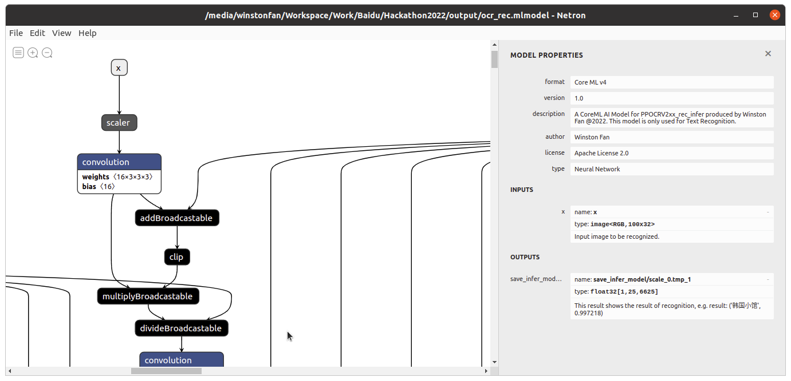

# PaddleOCR iOS部署教程

本篇文章将展示如何在Ubuntu 20.04下将中英文超轻量PP-OCRv2模型[ch_PP-OCRv2_det_infer](https://bj.bcebos.com/paddle2onnx/model_zoo/ch_PP-OCRv2_det_infer.tar), [ch_PP-OCRv2_cls_infer](https://bj.bcebos.com/paddle2onnx/model_zoo/ch_ppocr_mobile_v2.0_cls_infer.tar)以及[ch_PP-OCRv2_rec_infer](https://bj.bcebos.com/paddle2onnx/model_zoo/ch_PP-OCRv2_rec_infer.tar)一步一步的转换成iOS可识别的mlmodel格式模型.


该过程的步骤为:

1. 将Paddle 推理模型转换成ONNX模型
2. 将ONNX模型转换成 iOS识别的mlmodel格式模型
3. 将转换好的mlmodel模型导入Swift项目
4. 使用XCode自动为mlmodel模型生成的类来进行推理


## 1. 转换Paddle --> ONNX 模型

本教程将使用Anaconda来创建虚拟环境, 所以在开始转换之前,请确保您已经[安装好Anaconda](https://docs.anaconda.com/anaconda/install/index.html).

### 1. 创建一个新的conda环境

`conda create --name ios python=3.7`

激活新创建的环境

`conda activate ios`

### 2. 安装依赖项

`conda install onnx coremltools paddle2onnx onnx-simplifier`

如果上述某个依赖项找不到, 那么请用`pip`来安装, 例如:
`pip install paddle2onnx`

### 3. 转Paddle --> ONNX

#### 1. 转Paddle为ONNX
打开terminal, cd到刚才导出的infernece模型的文件夹下， 输入如下指令 即可将Paddle模型转换成ONNX模型

```
paddle2onnx --model_dir . --model_filename model.pdmodel \
--params_filename model.pdiparams --opset_version 11 \
--input_shape_dict "{'x': [1, 3, 960, 960]}" \
--enable_onnx_checker True \
--save_file ocr_det.onnx
```

这里注意把 里面模型的目录指向正确的文件夹。 

`--input_shape_dict`用来指定了模型输入的shape: `{'x': [1,3,640,640]}`.

`--opset_version` 指定了使用算子的版本为11， 目前可以有 9 - 12.

`--enable_onnx_checker` 用来开启ONNX模型校验。


转换成功后您将会看到一个新生成的ONNX模型： `ocr_det.onnx`. 


#### 2. 模型简化

最后我们用`onnx-simplifier`来简化一下模型:

运行:
```
onnxsim ocr_det.onnx ocr_det_sim.onnx 
```


#### 3. 固定下来模型每个节点的Shape

运行[shape_infer.py](../shape_infer.py)来固定每个节点的shapes.

```
python shape_infer.py --input ocr_det_sim.onnx --output ocr_det_sim_fo.onnx
```

ONNX阶段转化完毕.

> ***[NOTE] 如果您想直接使用已经转换好的ONNX模型,可以在这里下载: [ocr_det_sim_fo.onnx](https://1drv.ms/u/s!Asflam6BEzhjgbNBPhzIEcnA2KB0NQ?e=zDJ8Im).***

## 2. ONNX --> Coreml模型

[CoreML](https://developer.apple.com/documentation/coreml)是苹果在iOS平台上的AI框架。 我们需要通过[Coremltools](https://coremltools.readme.io/docs)工具来把ONNX模型转换成为 `.mlmodel`格式的CoreML模型。

### 1. 配置好转换时候的参数

首先我们要知道ch_PP-OCR_det的配置是什么, 那么通过观察[ch_PP-OCRv2_det_cml.yml](https://github.com/PaddlePaddle/PaddleOCR/blob/release/2.4/configs/det/ch_PP-OCRv2/ch_PP-OCRv2_det_cml.yml), 我们看到它的Mean和Std分别是:

`mean: [0.485,0.456,0.406], std: [0.229, 0.224,0.225]`


```
model = ct.converters.onnx.convert(
    model = "ocr_det_sim_fo.onnx",    
    minimum_ios_deployment_target = '13',
    preprocessing_args={
        "image_scale": 1./(0.226*255.0),
        "red_bias": - 0.485/(0.229),
        "green_bias":- 0.456/(0.224),
        "blue_bias": - 0.406/(0.225)
    },
    image_input_names= ["x"]
)

saved_model_path = root / "ocr_det"
model.save(saved_model_path)
```

由于苹果并没有直接使用这些Mean和Std这些参数， 而是使用了自己定义的 `image_scale`和各个颜色通道的`bias`来表达`mean`以及`std`. 所以我们需要自己计算 `image_scale`以及各个通道的 `bias`. 
这里要划重点，下面的转换公式需要记住：

`output[channel] = (input[channel] - mean [channel]) / std [channel]`

并且我们又知道ImageNet的 `mean`和`std`分别是：

* `mean  [0.485, 0.456, 0.406]`
* `std (standard deviation)  [0.229, 0.224, 0.225]`

`mean`和`std`中的三个值分别对应`red`, `green` and `blue`。 

所以转换下来后的 `bias`分别是：

```
y_red_channel = (x_red_channel/255.0 - 0.485) / 0.229
y_green_channel = (x_green_channel/255.0 - 0.456) / 0.224
y_blue_channel = (x_blue_channel/255.0 - 0.406) / 0.225
```
所以 `bias`计算下来之后是：
```
bias = [- 0.485/(0.229) , - 0.456/(0.224), - 0.406/(0.225)]
```

`image_scale`的计算则是由3个`std`的平均值来表达：

```
0.226 = (0.229 + 0.224 + 0.225)/3)
```

以上就是在转换到CoreML模型的时候 最重要的概念。

之后，我们只需要调用`coremltools`的工具来存储转换好后的模型。

```
model.save(saved_model_path)
```

可以查看[完整代码](./ocr_def_convert.py) 来了解更多详细信息。

>***[Note]: 如果您想直接使用CoreML模型, 请在这里下载: [ocr_det.mlmodel](https://1drv.ms/u/s!Asflam6BEzhjgbNCAAvNUPBE7mbxFw?e=d8b2F8).***

## 3. 在Swift项目中导入CoreML模型

在打开CoreML模型之前, 请确保您已经安装了[XCode](https://developer.apple.com/xcode/).

在Mac上, 双击我们转换好的Ocr_det模型, 您将会看到:


要导入CoreML模型到您的Swift项目也很简单, 只需要把模型直接拖拽到项目里即可.
XCode会为您的模型自动生成类,来方便使用.

-----

# OCR Cls 模型转换

第二个模型Cls模型的转换和det的转换过程极为相似, 我们着重展示一下不一样的地方.

## 1. Paddle -> ONNX

当转换的时候 从模型的输入可以看出, 它的input_shape是 1,3,32,100那么我们相应的命令就是这样:


```
paddle2onnx --model_dir . --model_filename model.pdmodel \
--params_filename model.pdiparams --opset_version 11 \
--input_shape_dict "{'x': [1, 3, 32, 100]}" \
--enable_onnx_checker True \
--save_file ocr_cls.onnx
```

## 2. ONNX -> CoreML

参考OCR_cls模型的配置文件 [cls_mv3.yml](https://github.com/PaddlePaddle/PaddleOCR/blob/release/2.4/configs/cls/cls_mv3.yml) 可以看出, 它并没有用Normalize()所以我们需要将相应的bias部分去掉.


```
model = ct.converters.onnx.convert(
    model = "cls_sim_fo.onnx",
    minimum_ios_deployment_target = '13',
    image_input_names= ["x"]
)
```

之后可以看到:


---------------

# OCR Rec模型转换

这是最后一个模型. 同理,第三个模型Rec的转换和前面的转换过程极为相似, 我们着重展示一下不一样的地方.

## 1. Paddle -> ONNX


当转换的时候 从模型的输入可以看出, 它的input_shape是 1,3,32,100,所以相应的命令是一样的:
```
paddle2onnx --model_dir . --model_filename model.pdmodel \
--params_filename model.pdiparams --opset_version 11 \
--input_shape_dict "{'x': [1, 3, 32, 100]}" \
--enable_onnx_checker True \
--save_file ocr_rec.onnx    
```

## 2. ONNX -> CoreML

同样的,参考OCR_Rec模型的配置文件 [ch_PP-OCRv2_rec_distillation.yml](https://github.com/PaddlePaddle/PaddleOCR/blob/release/2.4/configs/rec/ch_PP-OCRv2/ch_PP-OCRv2_rec_distillation.yml) 可以看出, 它也并没有用Normalize()所以我们需要将相应的bias部分去掉.


```
model = ct.converters.onnx.convert(
    model = "rec_sim_fo.onnx",
    minimum_ios_deployment_target = '13',
    image_input_names= ["x"]
)
```

之后可以看到:


相关代码请查看: 

[orc_det_convert.py](ocr_det_convert.py)

[orc_cls_convert.py](ocr_cls_convert.py)

[orc_rec_convert.py](ocr_rec_convert.py)


想直接尝试的朋友可以直接下载已经转换好的模型:

<div style="width:100%; display:flex; justify-content:center;">

|  模型  | ONNX  |  CoreML  |
|:-----------:|:-----------:|:-----------:|
|  Det  |  [下载](https://1drv.ms/u/s!Asflam6BEzhjgbNBPhzIEcnA2KB0NQ?e=I2UCMF)  |  [下载](https://1drv.ms/u/s!Asflam6BEzhjgbNCAAvNUPBE7mbxFw?e=dkKmdD)  |
|  Cls  |  [下载](https://1drv.ms/u/s!Asflam6BEzhjgbNE86tuO33KOA3VBw?e=Aj6bPs)  |  [下载](https://1drv.ms/u/s!Asflam6BEzhjgbNDDgrBZDN_AjF7qQ?e=HkenrV)  |
|  Rec  |  [下载](https://1drv.ms/u/s!Asflam6BEzhjgbM_2Z0QQkQ-nUYQhQ?e=xbuCOE)  |  [下载](https://1drv.ms/u/s!Asflam6BEzhjgbNABqldy6AXX4MuNQ?e=n5C0VF)  |

</div>

