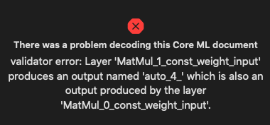
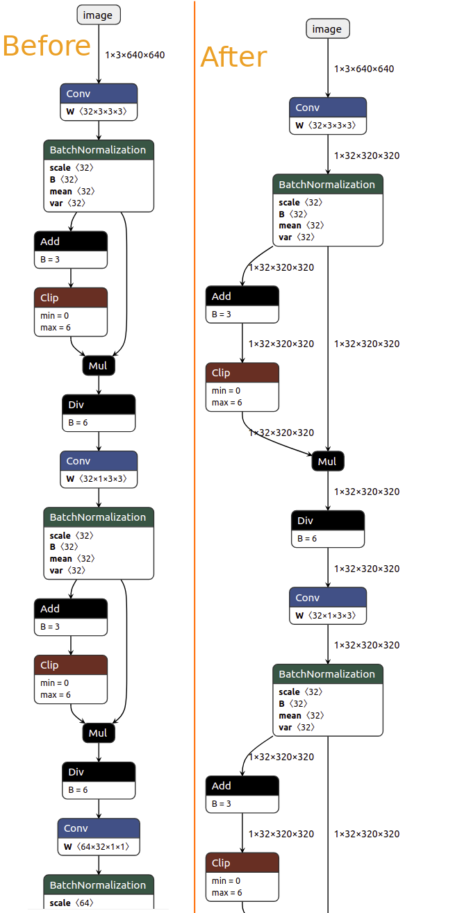
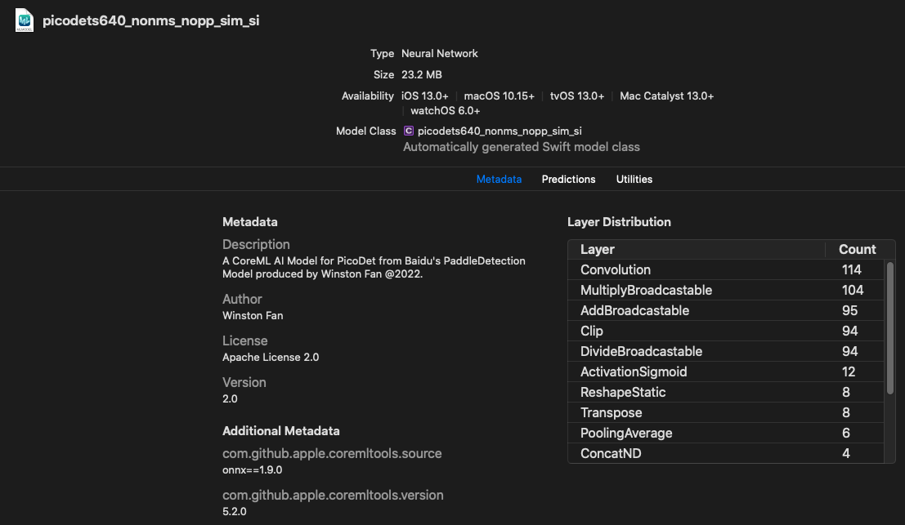

# PicoDet iOS部署教程

本篇文章将展示如何在Ubuntu 20.04下将PaddleDetection的明星物体检测模型[PicoDet](https://github.com/PaddlePaddle/Paddle2ONNX/tree/model_zoo/model_zoo/classification)一步一步的转换成iOS可识别的mlmodel格式模型.


该过程的步骤为:

0. 将Paddle模型转换成推理模型
1. 将Paddle 推理模型转换成ONNX模型
2. 将ONNX模型转换成 iOS识别的mlmodel格式模型
3. 将转换好的mlmodel模型导入Swift项目
4. 使用XCode自动为mlmodel模型生成的类来进行推理

## 0. 将Paddle动态模型导出为推理模型

相较于转换MobileNetV3模型, 在转换PicoDet模型的时候 多了**Step 0**. 在这一步,我们需要更多的处理来为最终的CoreML模型转换做准备. 而这个更多的步骤就发生在整个模型转换过程的最开始. 

> ***Note 1:***
> ***由于CoreML目前还不支持 Range, NonMaximumSuppression(NMS), 所以我们在已开始导出前就要指定不导出NMS模块. 

<div style="width:100%; display:flex;">
    
</div>

> ***Note 2:***
> 同时由于CoreML不允许多个模块的输出有同样的名字,而PicoDet的4个MatMul模块用了同样的输出名字 `auto_4_` 所以我们也需要把postprocess在导出过程中屏蔽掉. 这就是为什么会有 Step 0.***

Okay, 原因介绍完了, 那么我们开始实际操作.

首先需要克隆PaddleDetection项目:

`git clone https://github.com/PaddlePaddle/PaddleDetection.git`


然后CD到PaddleDetection的根目录下面, 在terminal下输入如下命令:

```
python tools/export_model.py -c configs/picodet/picodet_l_640_coco_lcnet.yml -o weights=https://paddle-imagenet-models-name.bj.bcebos.com/dygraph/legendary_models/PPLCNet_x2_0_pretrained.pdparams export.post_process=False export.nms=False  --output_dir=./output/picodet640_nonms_nopostprocess
```

来解释一下这个命令:

首先我们用 `-c`来指定这个模型导出时候需要用到的配置文件, 由于我们选择的是picodet_l_640, 所以指向`picodet_l_640_coco_lcnet.yml`;
同时用`-o weights`来指定模型的参数文件;
`export.post_process=False`是用来告诉Python export script不需要导出postprocess, 原因参见上面的Note部分;
`export.nms=False`指定了不包括NMS模块.

成功之后, 将会产生4个文件 
`infer_cfg.yml`, `model.pdiparams`, `model.pdiparams.info`,`model.pdmodel`

第一步完成.


## 1. 转换Paddle --> ONNX 模型

本教程将使用Anaconda来创建虚拟环境, 所以在开始转换之前,请确保您已经[安装好Anaconda](https://docs.anaconda.com/anaconda/install/index.html).

### 1. 创建一个新的conda环境

`conda create --name ios python=3.7`

激活新创建的环境

`conda activate ios`

### 2. 安装依赖项

`conda install onnx coremltools paddle2onnx onnx-simplifier`

如果上述某个依赖项找不到, 那么请用`pip`来安装, 例如:
`pip install paddle2onnx`

### 3. 转Paddle --> ONNX

#### 1. 转Paddle为ONNX
打开terminal, cd到刚才导出的infernece模型的文件夹下， 输入如下指令 即可将Paddle模型转换成ONNX模型

```
paddle2onnx --model_dir . --model_filename model.pdmodel \
--params_filename model.pdiparams --opset_version 11 \
--input_shape_dict "{'image': [1, 3, 640, 640 ]}" \
--enable_onnx_checker True \
--save_file picodetl640lcnet_op11.onnx
```

这里注意把 里面模型的目录指向正确的文件夹。 

`--input_shape_dict`用来指定了模型输入的shape: `{'inputs': [1,3,640,640]}`.

`--opset_version` 指定了使用算子的版本为11， 目前可以有 9 - 12.

`--enable_onnx_checker` 用来开启ONNX模型校验。


转换成功后您将会看到一个新生成的ONNX模型： `picodetl640lcnet_op11.onnx`. 


#### 2. 固定下来模型每个节点的Shape

运行[shape_infer.py](../shape_infer.py)来固定每个节点的shapes.

```
python shape_infer.py --input picodetl640lcnet_op11.onnx --output picodetl640lcnet_op11_shape_infered.onnx
```



可以清楚的看到在固定下Shape之后 每个节点输出都可以看到清楚的Shape, 方便后期差错处理.

#### 3. 模型简化

最后我们用`onnx-simplifier`来简化一下模型:

运行:
```
onnxsim picodetl640lcnet_op11_shape_infered.onnx picodetl640lcnet_op11_nonms_nopp_sim.onnx 
```

ONNX阶段转化完毕.

> ***[NOTE] 如果您想直接使用已经转换好的ONNX模型,可以在这里下载: [picodetl640lcnet_op11_nonms_nopp_sim.onnx](https://1drv.ms/u/s!Asflam6BEzhjgbM80p9kMoq03wPa5Q?e=be13JV).***

## 2. ONNX --> Coreml模型

[CoreML](https://developer.apple.com/documentation/coreml)是苹果在iOS平台上的AI框架。 我们需要通过[Coremltools](https://coremltools.readme.io/docs)工具来把ONNX模型转换成为 `.mlmodel`格式的CoreML模型。

### 1. 配置好转换时候的参数

首先我们要知道PicoDet-l-640的配置是什么, 那么通过观察[picodet_l_640_coco_lcnet.yml](https://github.com/PaddlePaddle/PaddleDetection/blob/release/2.4/configs/picodet/picodet_l_640_coco_lcnet.yml), 我们看到它的Mean和Std分别是:

`mean: [0.485,0.456,0.406], std: [0.229, 0.224,0.225]`


```
model = ct.converters.onnx.convert(
    model = "picodetl640lcnet_op11_nonms_nopp_sim.onnx",    
    minimum_ios_deployment_target = '13',
    preprocessing_args={
        "image_scale": 1./(0.226*255.0),
        "red_bias": - 0.485/(0.229),
        "green_bias":- 0.456/(0.224),
        "blue_bias": - 0.406/(0.225)
    },
    image_input_names= ["image"]
)

saved_model_path = root / "picodet640"
model.save(saved_model_path)
```

由于苹果并没有直接使用这些Mean和Std这些参数， 而是使用了自己定义的 `image_scale`和各个颜色通道的`bias`来表达`mean`以及`std`. 所以我们需要自己计算 `image_scale`以及各个通道的 `bias`. 
这里要划重点，下面的转换公式需要记住：

`output[channel] = (input[channel] - mean [channel]) / std [channel]`

并且我们又知道ImageNet的 `mean`和`std`分别是：

* `mean  [0.485, 0.456, 0.406]`
* `std (standard deviation)  [0.229, 0.224, 0.225]`

`mean`和`std`中的三个值分别对应`red`, `green` and `blue`。 

所以转换下来后的 `bias`分别是：

```
y_red_channel = (x_red_channel/255.0 - 0.485) / 0.229
y_green_channel = (x_green_channel/255.0 - 0.456) / 0.224
y_blue_channel = (x_blue_channel/255.0 - 0.406) / 0.225
```
所以 `bias`计算下来之后是：
```
bias = [- 0.485/(0.229) , - 0.456/(0.224), - 0.406/(0.225)]
```

`image_scale`的计算则是由3个`std`的平均值来表达：

```
0.226 = (0.229 + 0.224 + 0.225)/3)
```

以上就是在转换到CoreML模型的时候 最重要的概念。

之后，我们只需要调用`coremltools`的工具来存储转换好后的模型。

```
model.save(saved_model_path)
```

可以查看[完整代码](./picodets640_convert.py) 来了解更多详细信息。

>***[Note]: 如果您想直接使用CoreML模型, 请在这里下载: [PicoDet.mlmodel](https://1drv.ms/u/s!Asflam6BEzhjgbM80p9kMoq03wPa5Q?e=ZhhqkU).***

## 3. 在Swift项目中导入CoreML模型

在打开CoreML模型之前, 请确保您已经安装了[XCode](https://developer.apple.com/xcode/).

在Mac上, 双击我们转换好的Pico模型, 您将会看到:



要导入CoreML模型到您的Swift项目也很简单, 只需要把模型直接拖拽到项目里即可.
XCode会为您的模型自动生成类,来方便使用.