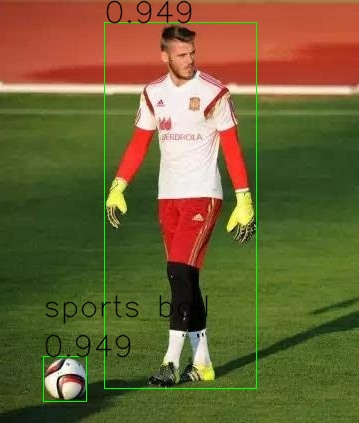

# RK模型检测模型部署指南

本文档介绍在RK系列芯片上部署Picodet检测模型的步骤，具体包括：

1. 使用Paddle2ONNX将PaddleInference model转换为ONNX模型格式。
2. 运行推理脚本获得推理结果。

## 模型转换

模型版本为: [PaddleDetection 2.3分支](https://github.com/PaddlePaddle/PaddleDetection/tree/release/2.3/configs/picodet)

```text
# 下载ONNX模型
# 进入目录
cd ./weights
mkdir onnx
cd onnx
# 下载picodet模型
wget https://paddlelite-demo.bj.bcebos.com/onnx%26rknn2_model/picodet_s_320_coco_sim.onnx

# 下载转换好的RKNN模型
# 进入目录
cd ./weights
mkdir rknn
cd rknn
# 下载picodet模型
wget https://paddlelite-demo.bj.bcebos.com/onnx%26rknn2_model/picodet_s_320_coco_sim.rknn
```

## 运行

### 更多参数

执行以下命令

```text
python picodet_infer.py -h
```

### ONNX

推理执行以下命令

```text
python picodet_infer.py
```

### RKNN for PC

推理执行以下命令

```text
python picodet_infer.py --backend_type rk_pc
```

### RKNN for Board

推理执行以下命令

```text
sudo -E python3 picodet_infer.py --backend_type rk_board --model_path ./weights/rknn/picodet_s_320_coco_sim.rknn 
```

## 推理速度

基本信息：

- 环境：RK3588 + rknn_toolkit2 develop 最新版
- 数据集：coco2017 val数据集的前700张图片

数据表:

| 模型            | iou(0.5) | speed(ms) |
|---------------|----------|-----------|
| ONNX          | 0.451    | 41        |
| rk_board(量化前) | 0.451    | 70        |

## 查看结果

输入图片


输出图片
