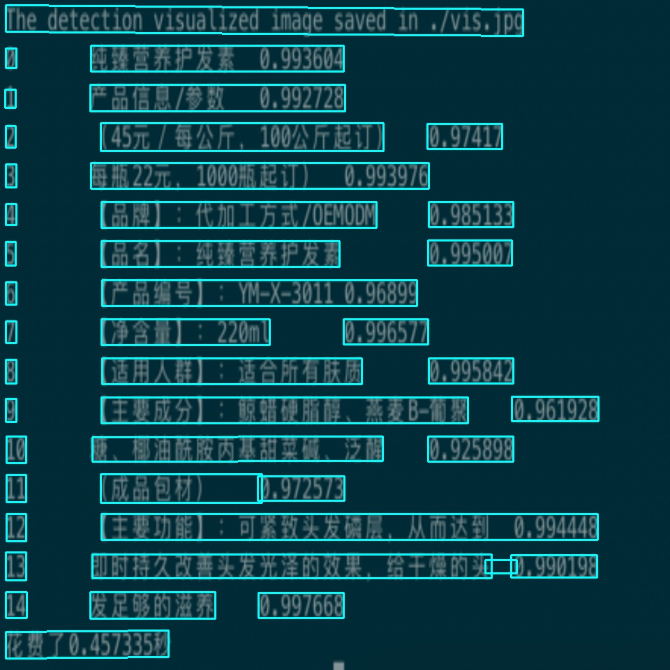

# RK模型OCR模型部署指南
本文档介绍在RK系列芯片上部署OCR模型的步骤，具体包括：
1. 使用Paddle2ONNX将PaddleInference model转换为ONNX模型格式。 
2. 运行推理脚本获得推理结果。

## 模型转换
```text
# 下载PP-OCRv2模型
# 下载onnx模型
# 进入目录
cd ./weights
mkdir onnx
cd onnx
wget https://paddlelite-demo.bj.bcebos.com/onnx%26rknn2_model/PP_OCR_v2_cls.onnx
wget https://paddlelite-demo.bj.bcebos.com/onnx%26rknn2_model/PP_OCR_v2_det.onnx
wget https://paddlelite-demo.bj.bcebos.com/onnx%26rknn2_model/PP_OCR_v2_rec.onnx

# 下载RKNN模型
cd ./weights
mkdir rknn
cd rknn
wget https://paddlelite-demo.bj.bcebos.com/onnx%26rknn2_model/PP_OCR_v2_cls.rknn
wget https://paddlelite-demo.bj.bcebos.com/onnx%26rknn2_model/PP_OCR_v2_det.rknn
wget https://paddlelite-demo.bj.bcebos.com/onnx%26rknn2_model/PP_OCR_v2_rec.rknn
```

## 运行
### 更多参数
执行以下命令
```text
python PP_OCR_infer.py -h
```
### ONNX
推理执行以下命令
```text
python PP_OCR_infer.py
```

### RKNN for PC
推理执行以下命令
```text
python PP_OCR_infer.py --backend_type rk_pc
```

### RKNN for Board
推理执行以下命令
```text
sudo -E python3 PP_OCR_infer.py --backend_type rk_board \
                                  --det_model_dir ./weights/rknn/PP_OCR_v2_det.rknn \
                                  --cls_model_dir ./weights/rknn/PP_OCR_v2_cls.rknn \
                                  --rec_model_dir ./weights/rknn/PP_OCR_v2_rec.rknn
```

## 结果展示
### pp_ocr_v2_det
输入图片


输出图片



