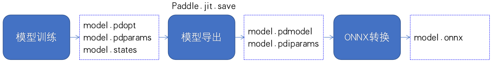

# 图像分割

本章节介绍 PaddleSeg 模型如何转化为 ONNX 模型，并基于 ONNXRuntime 引擎预测。

## 1. 环境准备

需要准备 PaddleOCR、Paddle2ONNX 模型转化环境，和 ONNXRuntime 预测环境

###  PaddleSeg

```
git clone https://github.com/PaddlePaddle/PaddleSeg.git -b release/2.4
cd PaddleSeg && python3.7 setup.py install
```

###  Paddle2ONNX

Paddle2ONNX 支持将 PaddlePaddle 模型格式转化到 ONNX 模型格式，算子目前稳定支持导出 ONNX Opset 9~11，部分Paddle算子支持更低的ONNX Opset转换。
更多细节可参考 [Paddle2ONNX](https://github.com/PaddlePaddle/Paddle2ONNX/blob/develop/README_zh.md)

- 安装 Paddle2ONNX
```
python3.7 -m pip install paddle2onnx
```

###  ONNXRuntime

- 安装 ONNXRuntime
```
# 建议安装 1.9.0 版本，可根据环境更换版本号
python3.7 -m pip install onnxruntime==1.9.0
```


## 2. 模型列表


各个模型的关系如下面的示意图所示。




下面的图像分割模型，来自PaddleSeg [release/2.4分支](https://github.com/PaddlePaddle/PaddleSeg/tree/release/2.4)

|模型名称|配置文件|模型大小|下载地址|
| --- | --- | --- | --- |
|BiSeNet|[bisenet_cityscapes_1024x1024_160k.yml](https://github.com/PaddlePaddle/PaddleSeg/blob/release/2.4/configs/bisenet/bisenet_cityscapes_1024x1024_160k.yml)| 3M |[推理模型]() / [ONNX模型](model.onnx)|
|DANet|[danet_resnet50_os8_cityscapes_1024x512_80k.yml](https://github.com/PaddlePaddle/PaddleSeg/blob/release/2.4/configs/danet/danet_resnet50_os8_cityscapes_1024x512_80k.yml)|3M|[推理模型]() / [ONNX模型](model.onnx)|
|DeepLabv3|[deeplabv3_resnet50_os8_cityscapes_1024x512_80k.yml](https://github.com/PaddlePaddle/PaddleSeg/blob/release/2.4/configs/deeplabv3/deeplabv3_resnet50_os8_cityscapes_1024x512_80k.yml)| 2.6M |[推理模型]() / [ONNX模型](model.onnx)|
|Deeplabv3P|[deeplabv3p_resnet50_os8_cityscapes_1024x512_80k.yml](https://github.com/PaddlePaddle/PaddleSeg/blob/release/2.4/configs/deeplabv3p/deeplabv3p_resnet50_os8_cityscapes_1024x512_80k.yml)|3M|[推理模型]() / [ONNX模型](model.onnx)|
|FCN|[fcn_hrnetw18_cityscapes_1024x512_80k.yml](https://github.com/PaddlePaddle/PaddleSeg/blob/release/2.4/configs/fcn/fcn_hrnetw18_cityscapes_1024x512_80k.yml)|47M|[推理模型]() / [ONNX模型](model.onnx)|


## 3. 验证ONNX推理结果正确性

- Paddle 模型下载

有两种方式获取Paddle静态图模型：在 [模型列表](## 2. 模型列表) 中下载PaddleSeg预测模型；
参考 [paddleseg模型导出说明](https://github.com/PaddlePaddle/PaddleSeg/blob/release/2.4/docs/model_export.md) 把训练好的权重转为 inference_model。

以BiSeNet为例：

```
wget -nc  -P ./inference https://paddleocr.bj.bcebos.com/paddle2onnx/models/pdmodel/bisenet.tar
cd ./inference && tar xf bisenet.tar && cd ..
```

- 模型转换

使用 Paddle2ONNX 将Paddle静态图模型转换为ONNX模型格式：

```
paddle2onnx --model_dir ./inference/bisenet \
--model_filename model.pdmodel \
--params_filename model.pdiparams \
--save_file ./inference/bisenet/model.onnx \
--opset_version 11 \
--input_shape_dict="{'x':[-1,3,-1,-1]}" \
--enable_onnx_checker True
```

执行完毕后，ONNX 模型会被分别保存在 `./inference/bisenet/`路径下; 或者直接在 [模型列表](## 2. 模型列表) 中下载BiseNet的ONNX模型

```
wget -nc  -P ./inference https://paddleocr.bj.bcebos.com/paddle2onnx/models/onnx/bisenet.tar
cd ./inference && tar xf bisenet.tar && cd ..
```


- 推理预测

ONNX模型测试步骤如下：

- Step1：初始化`ONNXRuntime`库并配置相应参数, 并进行预测
- Step2：`ONNXRuntime`预测结果和`Paddle Inference`预测结果对比

下载cityscapes验证集中的一张[图片](https://paddleseg.bj.bcebos.com/dygraph/demo/cityscapes_demo.png)

```bash
wget https://paddleseg.bj.bcebos.com/dygraph/demo/cityscapes_demo.png
```

执行如下命令：

```bash
python3.7 infer.py \
    --model_path ./inference/bisenet/model \
    --onnx_path ./inference/bisenet/model.onnx \
    --image_path ./cityscapes_demo.png
```

执行命令后在终端会打印出预测的识别信息，并在 ./inference_results/ 下保存可视化结果。

Paddle Inference 执行效果：

<div align="center">
    
</div>

ONNXRuntime 执行效果：

<div align="center">
    
</div>

在终端输出结果如下。

```
sess input/output name :  x argmax_0.tmp_0
The difference of results between ONNXRuntime and Paddle looks good!
max_abs_diff:  0.0

```

max_abs_diff为 0.0 表示`Paddle Inference`预测结果与`ONNXRuntime`引擎的结果完全一致。

## 3. FAQ
