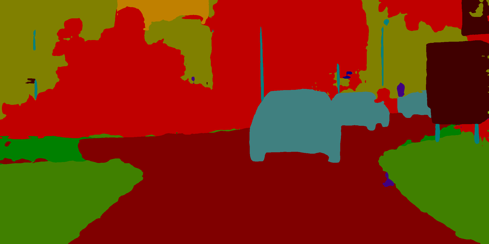

# 图像分割模型库

本文档中模型库均来源于PaddleSeg [release/2.4分支](https://github.com/PaddlePaddle/PaddleSeg/tree/release/2.4)，在下表中提供了部分已经转换好的模型，如有更多模型或自行模型训练导出需求，可参考 [paddleseg模型导出说明](https://github.com/PaddlePaddle/PaddleSeg/blob/release/2.4/docs/model_export.md).
|模型名称|配置文件|模型大小|下载地址|说明|
| --- | --- | --- | --- | ---- |
|BiSeNet|[bisenet_cityscapes_1024x1024_160k.yml](https://github.com/PaddlePaddle/PaddleSeg/blob/release/2.4/configs/bisenet/bisenet_cityscapes_1024x1024_160k.yml)|9.4M|[推理模型]() / [ONNX模型](model.onnx)| 使用CityScape数据作为训练数据，19个分类，包括车、路、人等等 |
|DANet|[danet_resnet50_os8_cityscapes_1024x512_80k.yml](https://github.com/PaddlePaddle/PaddleSeg/blob/release/2.4/configs/danet/danet_resnet50_os8_cityscapes_1024x512_80k.yml)|190.1M|[推理模型]() / [ONNX模型](model.onnx)| 使用CityScape数据作为训练数据，19个分类，包括车、路、人等等 |
|DeepLabv3|[deeplabv3_resnet50_os8_cityscapes_1024x512_80k.yml](https://github.com/PaddlePaddle/PaddleSeg/blob/release/2.4/configs/deeplabv3/deeplabv3_resnet50_os8_cityscapes_1024x512_80k.yml)|156.6M|[推理模型]() / [ONNX模型](model.onnx)| 使用CityScape数据作为训练数据，19个分类，包括车、路、人等等 |
|Deeplabv3P|[deeplabv3p_resnet50_os8_cityscapes_1024x512_80k.yml](https://github.com/PaddlePaddle/PaddleSeg/blob/release/2.4/configs/deeplabv3p/deeplabv3p_resnet50_os8_cityscapes_1024x512_80k.yml)|107.2M|[推理模型]() / [ONNX模型](model.onnx)| 使用CityScape数据作为训练数据，19个分类，包括车、路、人等等 |
|FCN|[fcn_hrnetw18_cityscapes_1024x512_80k.yml](https://github.com/PaddlePaddle/PaddleSeg/blob/release/2.4/configs/fcn/fcn_hrnetw18_cityscapes_1024x512_80k.yml)|39M|[推理模型]() / [ONNX模型](model.onnx)| 使用CityScape数据作为训练数据，19个分类，包括车、路、人等等 |


# 模型推理预测

- 环境依赖
    - paddlepaddle >= 2.0.2
    - paddleseg >= 2.4
    - paddle2onnx >= 0.9
    - onnxruntime >= 1.9.0

- 下载模型

以BiSeNet为例：

在[图像分割模型库](#图像分割模型库)，下载BiSeNet的推理模型和ONNX模型

```
wget -nc  -P ./inference https://paddleocr.bj.bcebos.com/paddle2onnx/models/pdmodel/bisenet.tar
cd ./inference && tar xf bisenet.tar && cd ..

wget -nc  -P ./inference https://paddleocr.bj.bcebos.com/paddle2onnx/models/onnx/bisenet.tar
cd ./inference && tar xf bisenet.tar && cd ..

```

其中ONNX模型也可以通过，如下命令生成：

```
paddle2onnx --model_dir ./inference/bisenet \
--model_filename model.pdmodel \
--params_filename model.pdiparams \
--save_file ./inference/bisenet/model.onnx \
--opset_version 11 \
--input_shape_dict="{'x':[-1,3,-1,-1]}" \
--enable_onnx_checker True
```

执行完毕后，ONNX 模型会被分别保存在 `./inference/bisenet/`路径下

- 推理预测

ONNX模型测试步骤如下：

- Step1：初始化`ONNXRuntime`库并配置相应参数, 并进行预测
- Step2：`ONNXRuntime`预测结果和`Paddle Inference`预测结果对比

下载cityscapes验证集中的一张[图片](https://paddleseg.bj.bcebos.com/dygraph/demo/cityscapes_demo.png)

```bash
wget https://paddleseg.bj.bcebos.com/dygraph/demo/cityscapes_demo.png
```

在本目录下，我们提供了`infer.py`脚本进行预测，执行如下命令即可

```bash
python3.7 infer.py \
    --model_path ./inference/bisenet/model \
    --onnx_path ./inference/bisenet/model.onnx \
    --image_path ./cityscapes_demo.png
```

执行命令后在终端会打印出预测的识别信息，并在 ./outputs/ 下保存可视化结果。

Paddle Inference 执行效果：

<div align="center">
    
</div>

ONNXRuntime 执行效果：

<div align="center">
    
</div>

在终端输出结果如下。

```
sess input/output name :  x argmax_0.tmp_0
The difference of results between ONNXRuntime and Paddle looks good!
max_abs_diff:  0.0

```

max_abs_diff为 0.0 表示`Paddle Inference`预测结果与`ONNXRuntime`引擎的结果完全一致。
