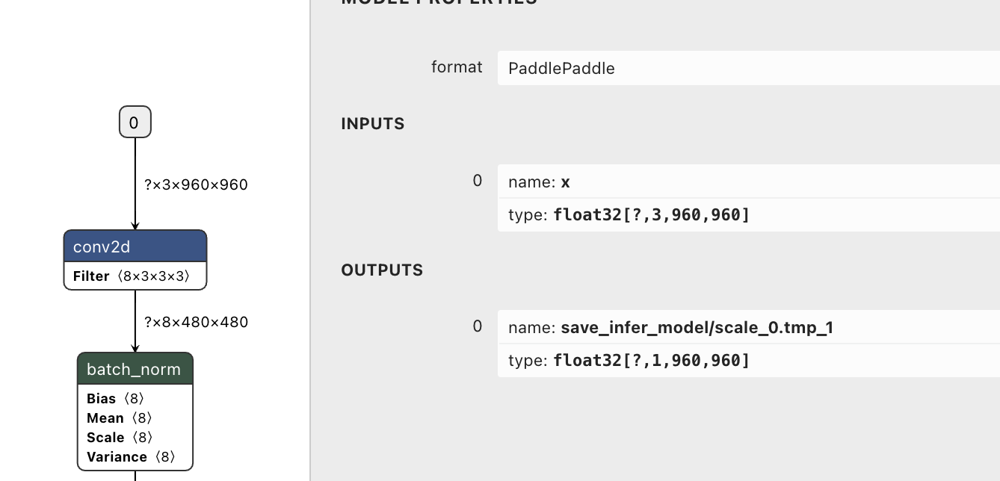
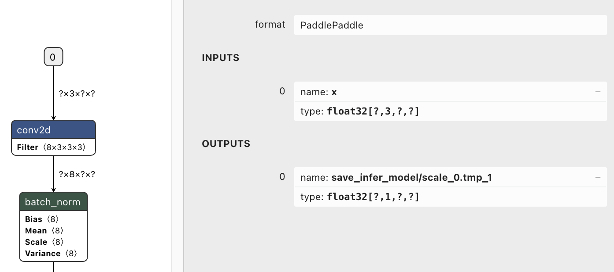

# Paddle 模型优化工具

## 1. 裁剪 Paddle 模型

部分场景下，我们可能只需要原 Paddle 模型中的一部分，因此可以通过以下方式，指定输出，进行模型裁剪（需要注意的是，如若裁剪后，输出不依赖某个模型输入，那么此模型输入也会被裁掉）
```
python prune_paddle_model.py --model_dir original_paddle_model  \
                             --model_filename model.pdmodel \
                             --params_filename model.pdiparams \
                             --output_names unsqueeze2_0.tmp_0 unsqueeze2_0.tmp_0 \
                             --save_dir new_paddle
```

其中`--output_names`可指定多个输出

## 2. 修改 Paddle 模型输入 Shape

以 OCR 模型为例，[点击下载](https://paddleocr.bj.bcebos.com/PP-OCRv2/chinese/ch_PP-OCRv2_det_infer.tar) OCR 的检测模型，通过 Netron 可视化这个模型，可以看到其输入名为 `x`，形状为 `[-1, 3, 960, 960]` ( ? 即为 -1 )
  

事实上，这个模型的结构是可以支持动态形态输入的，我们使用 `paddle_infer_shape.py` 脚本进行重新导出模型，再通过 Netron 查看模型，可以看到新模型的输入输出都已经更新了
```
python paddle_infer_shape.py --model_dir ch_PP-OCRv2_det_infer/ \
                             --model_filename inference.pdmodel \
                             --params_filename inference.pdiparams \
                             --save_dir new_model \
                             --input_shape_dict="{'x':[-1,3,-1,-1]}"
```


## 3. 合并 Paddle 模型的参数

如果你 Paddle 模型的参数文件是分开的小文件，想将这些分开的参数合并为一个文件，可以使用 merge_params.py 脚本进行处理，合并如下命令：
```
python merge_params.py inference_model  new_model_dir
```
